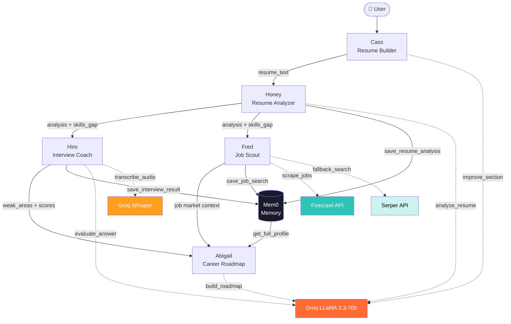

# 🤖 Baymax — AI Career Copilot

<div align="center">

**A multi-agent AI system that takes you from raw resume to job offer — all in one pipeline.**

[](https://baymax-app-six.vercel.app)
[](https://baymax-app-ozhwo.ondigitalocean.app/health)
[](LICENSE)

</div>

---

## 🎯 The Problem

**Every year, millions of job seekers in Pakistan and globally fail to land interviews — not because they lack skills, but because they lack access to quality career infrastructure.**

Specifically:
- **Resume quality gap** — Most freshers and mid-level candidates submit ATS-incompatible resumes with no keywords aligned to the job description
- **Interview unpreparedness** — Mock interview services are expensive; free YouTube content is generic and non-personalized  
- **Information asymmetry** — Candidates don't know which companies are hiring, what skills are in demand, or what certifications are worth their time
- **No personalized roadmap** — Career advice online is either too generic or behind a paywall

> **Baymax exists to be the AI career co-pilot that everyone deserves — not just those who can afford a career coach.**

---

## 🧠 Why Multi-Agent?

A single LLM cannot reliably solve this problem. Here's why:

| Single-Model Limitation | How Baymax Solves It with Multi-Agent Design |
|------------------------|---------------------------------------------|
| Can't specialize deeply across domains | Each agent is purpose-built with its own system prompt, tools, and memory context |
| Can't use external APIs mid-generation | Agents call Firecrawl, Serper, Groq Whisper as specialized tools |
| No persistent memory across sessions | Memory Agent (Mem0) stores user context across all pipeline stages |
| Analysis + Generation = conflicting objectives | Resume Analyzer and Roadmap Planner have separate objectives and prompts |
| Voice transcription requires a separate model | Interview Agent invokes Whisper (a separate model) for STT |

**The pipeline is sequential and stateful** — each agent's output enriches the context of the next. The Career Roadmap agent, for example, consumes outputs from all three upstream agents (resume analysis scores, interview weak areas, job search results) to generate a truly personalized 90-day plan.

---

## 🕹️ Agent Breakdown

```
USER
 │
 ▼
┌─────────────────────────────────────────────────────────────────┐
│  STAGE 1 — CASS (Resume Builder Agent)                          │
│  • Accepts raw text input or PDF upload                         │
│  • AI-enhances individual resume sections (bullets, summary)    │
│  • Generates ATS-friendly resume preview (PDF-ready)            │
│  • Output → resume_text handed to Stage 2                       │
└──────────────────────────┬──────────────────────────────────────┘
                           │ resume_text
                           ▼
┌─────────────────────────────────────────────────────────────────┐
│  STAGE 2 — HONEY (Resume Analyzer Agent)                        │
│  • Extracts text from PDF using PyMuPDF                         │
│  • Calls Groq LLaMA 3.3-70b to score: ATS, Match, Overall      │
│  • Returns: strengths, weaknesses, missing keywords,            │
│    section feedback, and 5 improved bullet rewrites             │
│  • Persists analysis to Mem0 memory                             │
│  • Output → analysis_result + skills_gap handed to Stage 3 & 4 │
└──────────────────────────┬──────────────────────────────────────┘
                           │ job_title + skills_gap + analysis
                           ▼
┌─────────────────────────────────────────────────────────────────┐
│  STAGE 3 — HIRO (Interview Coach Agent)                         │
│  • Opens a stateful interview session (UUID-tracked)            │
│  • Asks 8 tailored questions based on job title + resume        │
│  • Scores each answer 1-10, provides real-time feedback         │
│  • Supports voice input via Groq Whisper (speech-to-text)       │
│  • Tracks weak areas → persisted to Mem0                        │
│  • Output → avg_score + weak_areas handed to Stage 4            │
└──────────────────────────┬──────────────────────────────────────┘
                           │ skills_gap + interview_weak_areas
                           ▼
┌─────────────────────────────────────────────────────────────────┐
│  STAGE 4 — FRED (Job Scout Agent)                               │
│  • Searches live jobs via Firecrawl (primary)                   │
│  • Falls back to Serper Google Search API                       │
│  • Returns 6 formatted job cards with role, company, match %    │
│  • Persists search context to Mem0                              │
│  • Output → job market context handed to Stage 5                │
└──────────────────────────┬──────────────────────────────────────┘
                           │ all prior outputs + job context
                           ▼
┌─────────────────────────────────────────────────────────────────┐
│  STAGE 5 — ABIGAIL (Career Roadmap Agent)                       │
│  • Reads: skills_gap, interview_weak_areas, resume scores       │
│  • Generates personalized 90-day learning plan with:            │
│    - Week-by-week milestones                                    │
│    - Free course recommendations (Coursera, YouTube, etc.)      │
│    - Certification roadmap                                      │
│    - Financial aid email templates                              │
│  • Interactive Q&A chat (Rahul persona)                         │
└─────────────────────────────────────────────────────────────────┘
                           │
                           ▼
┌─────────────────────────────────────────────────────────────────┐
│  MEMORY LAYER — Mem0 (Cross-Agent Shared Context)               │
│  • All agents read/write to user profile in Mem0                │
│  • Enables: personalized context, continuity across tabs        │
│  • Stores: resume analysis, interview scores, job searches      │
└─────────────────────────────────────────────────────────────────┘
```

### Agent Communication Protocol

Agents communicate through two channels:

1. **Direct State Passing (Real-time):** The React frontend maintains a `useUserSession` hook that carries structured outputs from each stage as React state — passed as props to downstream agent components.

2. **Persistent Memory (Cross-session):** Mem0 cloud memory stores structured user profiles. Any agent can query prior context using `user_id`.

```
Agent A → onAnalysisComplete(result) → useUserSession.setSession()
                                              ↓
                                    Agent B receives session.analysisResult
                                    Agent B also queries Mem0(user_id)
```

---

## 🏗️ Architecture Diagram



---

## 🎬 The Demo

A successful end-to-end run looks like this:

1. **Resume Builder tab** — User uploads their existing PDF resume. Baymax parses it into structured fields (name, experience, education, skills). User clicks ✨ AI Improve on their work experience bullets → Groq rewrites them with stronger action verbs and metrics.

2. **Resume Analyzer tab** — User pastes a job description (e.g., "Software Engineer at Arbisoft"). Baymax returns: **Overall: 78/100, ATS: 85, Match: 71**, highlights missing keywords like "Django, REST APIs, CI/CD", and provides 5 rewritten bullet points.

3. **Interview Coach tab** — Baymax opens a voice-enabled 8-question mock interview tailored to "Software Engineer at a Pakistani startup." User speaks their answer → Whisper transcribes it → LLaMA evaluates it with a score and improvement feedback in real-time.

4. **Job Scout tab** — After the interview, Baymax searches Rozee.pk / LinkedIn for "Software Engineer in Karachi" and returns 6 live job cards with match percentages.

5. **Career Roadmap tab** — Abigail synthesizes all prior data into a 90-day plan: "Week 1-2: Django REST Framework (free on YouTube), Week 3-4: Docker fundamentals (KodeKloud free tier)..." User chats with the Rahul persona: "How do I get a scholarship for the AWS cert?" → Rahul generates a financial aid email template.

---

## 🛡️ Responsible AI Considerations

### What Could Go Wrong?

| Risk | Likelihood | Impact |
|------|-----------|--------|
| Hallucinated job listings | Medium | High — user applies to fake jobs |
| Overconfident resume scores | Medium | Medium — builds false confidence |
| Biased interview feedback | Low | High — discriminatory language |
| User data exposure via Mem0 | Low | High — PII in cloud memory |
| Prompt injection via resume text | Low | Medium — jailbreak via PDF |

### Guardrails In Place

1. **Input Validation** — All endpoints validate minimum text lengths, file types (PDF only), and reject empty fields with 400 errors.

2. **Rate Limiting** — FastAPI `slowapi` middleware limits sensitive endpoints to 10 req/min per IP to prevent abuse.

3. **Output Parsing with Fallbacks** — All LLM responses are parsed with explicit fallback structures. If the model returns malformed JSON, safe defaults are returned rather than crashing.

4. **No PII Logging** — Resume text and user answers are never written to server logs. Only aggregate metadata (scores, job titles) is persisted.

5. **Job Listing Disclaimer** — The Job Scout tab explicitly labels results as "AI-curated suggestions" and links to the original source URL. Users are advised to verify listings directly.

6. **Mem0 Isolation** — Each user gets a unique `user_id`. No cross-user data leakage is possible at the API level.

7. **Explainability** — Every score (ATS, Match, Overall) includes textual reasoning. The interview feedback explains *why* an answer scored what it did.

8. **User Control** — Users can reset their profile, switch resume sources, and overwrite all AI-generated content manually.

---

## 🚀 Quick Start

### Prerequisites
- Python 3.11+, Node.js 18+

### 1. Clone & configure

```bash
git clone https://github.com/taha-zaidii/baymax.app.git
cd baymax.app
cp .env.example .env
# Fill in your API keys in .env
```

| Key | Source |
|-----|--------|
| `GROQ_API_KEY` | [console.groq.com](https://console.groq.com) (free) |
| `SERPER_API_KEY` | [serper.dev](https://serper.dev) (100 free/mo) |
| `FIRECRAWL_API_KEY` | [firecrawl.dev](https://firecrawl.dev) |
| `MEM0_API_KEY` | [app.mem0.ai](https://app.mem0.ai) (free tier) |

### 2. Start everything (one command)

```bash
bash start.sh
```

- Backend → **http://localhost:8000** (FastAPI + Swagger at `/docs`)
- Frontend → **http://localhost:8080** (React + Vite)

### 3. Manual start

```bash
# Backend
cd backend && python3 -m venv venv && source venv/bin/activate
pip install -r requirements.txt
uvicorn api:app --host 0.0.0.0 --port 8000 --reload

# Frontend (separate terminal)
cd frontend && npm install && npm run dev
```

---

## 🌐 Production Deployment

| Service | URL |
|---------|-----|
| **Frontend (Vercel)** | https://baymax-app-six.vercel.app |
| **Backend (DigitalOcean)** | https://baymax-app-ozhwo.ondigitalocean.app |
| **API Health** | https://baymax-app-ozhwo.ondigitalocean.app/health |
| **API Docs** | https://baymax-app-ozhwo.ondigitalocean.app/docs |

---

## 🔌 API Reference

| Method | Endpoint | Agent | Description |
|--------|----------|-------|-------------|
| `GET` | `/health` | — | Backend health + API key status |
| `POST` | `/extract-resume` | Cass | PDF → extracted text |
| `POST` | `/resume/analyze` | Honey | Analyze resume vs JD (JSON) |
| `POST` | `/resume/analyze/upload` | Honey | Analyze resume vs JD (PDF upload) |
| `POST` | `/resume/improve` | Cass | Rewrite a single bullet |
| `POST` | `/resume/improve-section` | Cass | Improve a full section |
| `POST` | `/resume/generate-section` | Cass | Generate a section from scratch |
| `POST` | `/resume/save-profile` | Mem0 | Persist profile to memory |
| `GET` | `/resume/profile/{user_id}` | Mem0 | Retrieve saved profile |
| `POST` | `/interview/start` | Hiro | Begin interview session |
| `POST` | `/interview/reply` | Hiro | Submit answer, get feedback |
| `POST` | `/interview/transcribe` | Hiro | Voice (audio) → text |
| `POST` | `/interview/save-result` | Mem0 | Save interview scores |
| `POST` | `/jobs` | Fred | Search live job listings |
| `POST` | `/roadmap` | Abigail | Generate 90-day plan |
| `POST` | `/roadmap/certifications` | Abigail | Recommend certifications |
| `POST` | `/roadmap/chat` | Abigail | Chat with career mentor |

---

## 🛠️ Tech Stack

| Layer | Technology |
|-------|-----------|
| **LLM** | Groq LLaMA 3.3-70b (inference), Groq Whisper (STT) |
| **Memory** | Mem0 (cloud, cross-agent persistent memory) |
| **Job Search** | Firecrawl (primary), Serper API (fallback) |
| **Backend** | FastAPI, Python 3.11, PyMuPDF, SlowAPI |
| **Frontend** | React 18, TypeScript, Vite, shadcn/ui |
| **Deploy** | DigitalOcean App Platform (backend), Vercel (frontend) |

---

## 📁 Project Structure

```
baymax.app/
├── backend/
│   ├── api.py                    ← All FastAPI endpoints (rate-limited)
│   ├── config.py                 ← API key validation
│   ├── requirements.txt
│   ├── agents/
│   │   ├── resume_agent.py       ← Honey (Groq LLaMA 3.3-70b)
│   │   ├── interview_agent.py    ← Hiro (Groq LLaMA + Whisper)
│   │   ├── job_search_agent.py   ← Fred (Firecrawl + Serper)
│   │   ├── career_planner_agent.py ← Abigail (Groq LLaMA 3.3-70b)
│   │   └── memory_agent.py       ← Mem0 cross-agent memory
│   └── tools/
│       ├── pdf_tool.py           ← PDF text extraction (PyMuPDF)
│       └── search_tool.py        ← Serper fallback search
│
├── frontend/
│   └── src/
│       ├── components/
│       │   ├── ResumeBuilder.tsx  ← Cass UI
│       │   ├── ResumeAnalyzer.tsx ← Honey UI
│       │   ├── InterviewCoach.tsx ← Hiro UI
│       │   ├── JobSearch.tsx      ← Fred UI
│       │   ├── CareerRoadmap.tsx  ← Abigail UI
│       │   └── Dashboard.tsx      ← Orchestration + progress
│       ├── hooks/
│       │   └── use-user-session.ts ← Cross-agent state bridge
│       └── lib/api.ts             ← Typed API client
│
├── start.sh                       ← One-command local start
├── .env.example                   ← Environment template
└── README.md
```

---

## 📝 License

MIT — see [LICENSE](LICENSE)

---

<div align="center">
Built for <strong>AI Mustaqbil 2.0</strong> Hackathon · Multi-Agentic Systems Track
</div>
